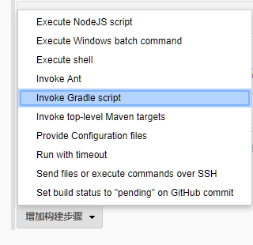
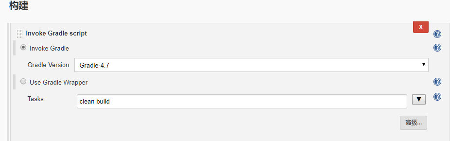
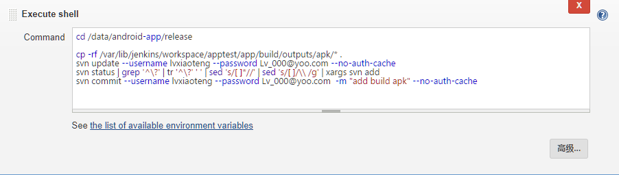

## Jenkins 持续集成 Android 项目

- 本部分基本流程如下：

  ```bash
  1、 开发人员提交代码到 gitlab 上；
  2、 手动或自动触发 Jenkins 编译构建并将构建完成的产出文件 SVN 或 Git 服务器的指定目录下；
  ```

### 配置 Jenkins 相关工具

- 安装完 Jenkins 后，针对 Android 项目我们需要配置 Jenkins，具体配置参数参见：[ Jenkins-Android-config ](../Jenkins/jenkins-android-config.md)


### Jenkins 新建 Android 项目
- 打开 Jenkins 控制面板按如下步骤操作即可：
- "**新建任务**"--"**输入任务名称**"--"**构建一个自由风格的项目**"--"**确定**"
- 点击确定后会弹出项目相关配置界面，我们需要配置相关信息，具体包括： General-源码管理-构建触发器-构建环境-构建-构建后操作，其中 “General-源码管理-构建触发器-构建环境” 配置和配置 java 项目的配置类似，具体参见 [ jenkins 持续集成 java 项目](../CI/ci-java-war-project-config.md),这里只是说明一下不同的地方的配置，具体如下：

- **构建操作**
- “**增加构建步骤**” -- “**Invoke Gradle Script**” 如下图所示：
- 

- 具体构建信息如下图所示：
- 

- 构建完成后需要将构建的 apk 安装包上传至 svn 或 git 服务器指定目录下，这里以 svn 为例，添加构建操作： “**增加构建步骤**” -- “**Execute shell**” ,具体步骤如下图所示：
- 

- 具体命令参考如下：

  ```bash
  cd /data/android-app/release

  cp -rf /var/lib/jenkins/workspace/apptest/app/build/outputs/apk/* .
  svn update --username lvxiaoteng --password Lv_000@yoo.com --no-auth-cache
  svn status | grep '^\?' | tr '^\?' ' ' | sed 's/[ ]*//' | sed 's/[ ]/\\ /g' | xargs svn add
  svn commit --username lvxiaoteng --password Lv_000@yoo.com  -m "add build apk" --no-auth-cache
  ```

- 配置完成后就可以用 jenkins 构建安卓项目了。如果有报错还需根据报错信息排错。

- 当然也可以修改项目代码，将 apk 包构建到指定目录下，修改项目 `/app/build.gradle`  文件时，需要在 `android{}`添加如下代码：示例代码如下所示：

  ```xml
  applicationVariants.all { variant ->
        variant.outputs.each { output ->
            def today = new Date().format('MMdd-HHmm');//自定义添加日期
            def outputFile = output.outputFile;//def意为定义，其实你可以把它当做String outputFile = output.outputFile这样来理解
            def newFilePath = "/data/android-app/release";
            if (outputFile != null && outputFile.name.endsWith('.apk')) {
                def oldFileName = outputFile.name.replace(".apk","-" + defaultConfig.versionName + ".apk");//replace方法，将原本的xxx-release.apk更名为xxx-release-0802-1212-v1.0.0.apk这样的apk命名
                File newFile = new File(newFilePath);//指定移动到的目标目录
                output.outputFile = new File(newFile,oldFileName );//创建并生成目标目录
//               outputFile.delete()
            }else {
            }
        }
    }
  ```
  

  > 代码与测试包的 svn 地址不一样，需要将 apk 输出到另外一个专门的路径。 `/data/android-app/release` 是对应放置 apk 文件的路径，你需要先 checkout 下来，上面输出 apk 的路径与此路径必须一致。上传至 gitlab 的脚本与此大致类似，这里就不说明了。

