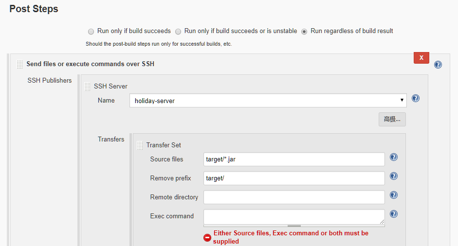

## Jenkins 持续集成 JAVA 项目 - JAR

- 本部分基本流程如下：

  ```bash
  1、 开发人员提交代码到 gitlab 上；
  2、 手动或自动触发 Jenkins 自动构建打 jar 包并将自动构建的 jar 包上传至指定服务器的指定目录下；
  3、 Jenkins 执行远程服务器脚本，kill 掉项目相关进程，将自动构建的 jar 上传至项目指定目录下，然后用新的 jar 启动进程
  ```

### 配置 Jenkins 相关工具

- 安装完 Jenkins 后，针对 JAVA 项目我们需要配置 Jenkins，具体配置参数参见：[Jenkins-java-config](../Jenkins/jenkins-java-config.md)

### Jenkins 新建 JAVA 项目
- 本部分流程和 [ Jenkins 新建 JAVA 项目](ci-java-war-project-config.md) 相同，唯一不同的是 “构建后的操作” 部分,具体区别如下图所示：

