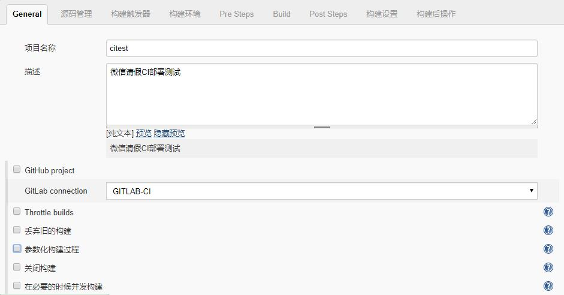

## Jenkins 持续集成 JAVA 项目 - WAR

- 本部分基本流程如下：

  ```bash
  1、 开发人员提交代码到 gitlab 上；
  2、 手动或自动触发 Jenkins 构建打 war 包并将自动构建的 war 包上传至指定服务器的指定目录下；
  3、 Jenkins 执行远程服务器脚本，kill 掉 Tomcat 相关进程，将自动构建的 war 上传至 Tomcat webapps 目录下，然后启动 Tomcat
  ```

### 配置 Jenkins 相关工具

- 安装完 Jenkins 后，针对 JAVA 项目我们需要配置 Jenkins，具体配置参数参见：[Jenkins-java-config](../Jenkins/jenkins-java-config.md)


### 配置 Maven

- Maven 是跨平台的项目管理工具，主要服务于基于 Java 平台的项目构建、依赖管理和项目信息管理。 Maven 的主要思想是约定优于配置。 通过将约定项目的目录结构，抽象项目的生命周期的方式，将程序员从繁琐的项目构建中解放出来。
- 因为 JAVA 项目大多数都是由 maven 编译打包的，所以我们需要配置一下 maven ，maven 的配置主要是配置 maven 仓库 ，一般 JAVA 项目的依赖主要由项目根目录下的 `pom.xml` 文件管理，由于网络的原因我们可能用默认的 maven 仓库下载项目依赖较困难，所以需要我们配置 maven 仓库。
- Maven 有一个默认的中央仓库： <http://repo1.maven.org/maven2>，该中央仓库包含了世界上大部分流行的开源项目。
- 我们可以从中央仓库下载需要的 jar 包，从中央仓库下载的 jar 包会统一保存在 maven 的本地仓库中。本地仓库在本机的 `.m2` 文件夹中。

#### 配置 Maven 仓库
- Maven 的配置文件一般为 Maven 安装目录的 `conf` 目录下的 `setting.xml` 文件，`setting.xml` 文件就在 `conf` 目录中。这里的 `setting.xml` 是 maven 全局的配置文件，不建议修改。修改之后会影响 maven 的升级等操作。常用的做法是拷贝一份 `setting.xml`到 maven 本地仓库的同一目录下，而本地仓库配置在用户目录的 `.m2` 目录下，此时的 `setting.xml` 就是用户级别的配置文件。

- **自定义本地仓库:**
- 修改 `setting.xml` 文件如下内容：

  ```xml
  <!-- localRepository
   | The path to the local repository maven will use to store artifacts.
   |
   | Default: ${user.home}/.m2/repository
  <localRepository>/path/to/local/repo</localRepository>
  -->
  ```

- 如需修改本地仓库路径只需修改 `<localRepository>` 字段即可，修改为我们自定义的路径即可。

- **配置多个远程仓库**

- 我们可以在这里配置多个远程仓库，具体包括 **中央仓库**、 **远程仓库** 。远程仓库又分为国内一些厂商的 maven 私服和我们自己搭建的 maven 私服。
- 远程仓库配置一般在 `setting.xml` 文件中的 `<repositories>` 字段内配置，具体配置可以参考如下内容：

  ```xml
  <profile>
    <id>nexus</id>
    <repositories>
        <repository>
            <id>nexus</id>
            <url>http://192.168.8.125:8080/repository/public/</url>
            <releases>
                <enabled>true</enabled>
                <updatePolicy>always</updatePolicy>
                <checksumPolicy>warn</checksumPolicy>
            </releases>
            <snapshots>
                <enabled>true</enabled>
                <updatePolicy>always</updatePolicy>
                <checksumPolicy>fail</checksumPolicy>
            </snapshots>
        </repository>
    </repositories>
        <pluginRepositories>
            <pluginRepository>
                <id>nexus</id>
                <url>http://192.168.8.125:8080/repository/public/</url>
                <releases>
                    <enabled>true</enabled>
                    <updatePolicy>always</updatePolicy>
                    <checksumPolicy>warn</checksumPolicy>
                </releases>
                <snapshots>
                    <enabled>true</enabled>
                    <updatePolicy>always</updatePolicy>
                    <checksumPolicy>fail</checksumPolicy>
                </snapshots>
            </pluginRepository>
        </pluginRepositories>
    </profile>
    ```

- 在 repositories 元素下，可以使用 repository 子元素声明一个或者多个远程仓库。

- **配置中央仓库镜像**
- 配置镜像仓库一般在 `setting.xml` 文件中的 `<mirrors>` 字段中，内容如下：

  ```xml
  <mirrors>
    ... 
    <mirror> 
    <id>maven.net.cn</id> 
    <name>one of the central mirrors in China</name>
    <url>http://maven.net.cn/content/groups/public/</url> 
    <mirrorOf>central</mirrorOf> 
    </mirror>
    ...
  </mirrors>
  ```

- **配置私服镜像：**
- 常用的私服镜像有阿里云、开源中国、网易等，具体配置和配置中央仓库镜像类似，具体内容如下,我们以阿里云仓库镜像做参考：

  ```xml
  <mirrors>
  	...
    <mirror>
      <id>alimaven</id>
      <name>aliyun maven</name>
      <url>http://maven.aliyun.com/nexus/content/groups/public/</url>
      <mirrorOf>central</mirrorOf>
    </mirror>
    ...
  </mirrors>
  ```

- 同样的，我们也可以配置多个私服镜像。

- **仓库搜索服务:**
- 以下网站提供 Maven 仓库搜索功能：
- Sonatype Nexus地址：<http://repository.sonatype.org/>
- MVNrepository地址：<http://mvnrepository.com/>

#### Maven 仓库认证
- 大部分公共的远程仓库无须认证就可以直接访问，但我们在平时的开发中往往会部署自己的 Maven 远程仓库，出于安全方面的考虑，我们需要提供认证信息才能访问这样的远程仓库。
- 配置认证信息和配置远程仓库不同，远程仓库可以直接在 `pom.xml` 中配置，但是认证信息必须配置在 `settings.xml` 文件中。这是因为 `pom.xml` 往往是被提交到代码仓库中供所有成员访问的，而 `settings.xml` 一般只存在于本机。因此，在 `settings.xml` 中配置认证信息更为安全。
- Maven 仓库认证一般在 `setting.xml` 文件的 `<servers>` 字段内配置，具体信息可以参考如下：

  ```xml
  <servers>
  	...
    <server>
      <id>snapshots</id>
      <username>snapshots</username>
      <password>695633290D050F31CEC0C9D4BD4A57FE</password>
    </server>
    <server>
      <id>releases</id>
      <username>releases</username>
      <password>02B67C3EAE678DC49209D6DE4709A171</password>
    </server>
    ...
  </servers>
  ```

- 至此，针对 JAVA 项目中的 Maven 配置基本完成，接下来就是在 Jenkins 上新建项目实施自动构建了。

### Jenkins 新建 JAVA 项目
- 打开 Jenkins 控制面板按如下步骤操作即可：
- "**新建任务**"--"**输入任务名称**"--"**构建一个maven项目**"--"**确定**"
- 点击确定后会弹出项目相关配置界面，我们需要配置相关信息，具体包括： General-源码管理-构建触发器-构建环境-Pre Steps-Build-Post Steps-构建设置-构建后操作，具体选项配置参数如下描述：

- **General** 具体配置如下图所示：



