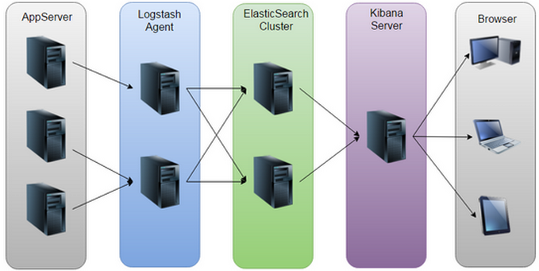

## ELK介绍
- ELK由Elasticsearch、Logstash和Kibana三部分组件组成；
- Elasticsearch: 是个开源分布式搜索引擎，它的特点有：分布式，零配置，自动发现，索引自动分片，索引副本机制，restful风格接口，多数据源，自动搜索负载等。
- Logstash: 是一个完全开源的工具，它可以对你的日志进行收集、分析，并将其存储供以后使用。
- Kibana: 是一个开源和免费的工具，它可以为 Logstash 和 ElasticSearch 提供的日志分析友好的 Web 界面，有助于汇总、分析和搜索重要数据日志。

- ELK官网：<https://www.elastic.co>
- ELK官网文档：<https://www.elastic.co/guide/index.html>
- ELK中文手册：<http://kibana.logstash.es/content/elasticsearch/monitor/logging.html>

### ELK四大组件
- Logstash: logstash server端用来搜集日志；
- Elasticsearch: 存储各类日志；
- Kibana: web化接口用作查寻和可视化日志；
- Logstash Forwarder: logstash client端用来通过lumberjack 网络协议发送日志到logstash server；

### ELK工作流程
- 在需要收集日志的所有服务上部署logstash，作为logstash agent（logstash shipper）用于监控并过滤收集日志，将过滤后的内容发送到Redis，然后logstash indexer将日志收集在一起交给全文搜索服务ElasticSearch，可以用ElasticSearch进行自定义搜索通过Kibana 来结合自定义搜索进行页面展示。
- ELK工作原理图：
- 

- 注释：
  - ELK有两种安装方式
  - (1)集成环境：Logstash有一个集成包，里面包括了其全套的三个组件；也就是安装一个集成包。
  - (2)独立环境：三个组件分别单独安装、运行、各司其职。(比较常用)
