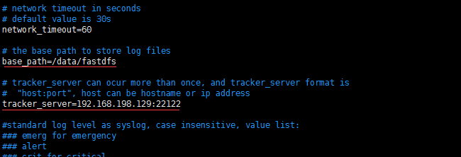

## FastDFS上传及下载测试

#### 上传测试
- 完成上面的步骤后，我们已经安装配置完成了全部工作，接下来就是测试了。因为执行文件全部在/usr/bin目录下，我们切换到这里，并新建一个test.txt文件，随便写一点什么，我写了This is a test file. by:mafly这句话在里边。然后测试上传：
- `cd /usr/bin`
- `echo "This is a test file. by:mafly" > test.txt`

#### 编辑client.conf文件
- `cd /etc/fdfs`
- `cp client.conf.sample client.conf`
- `vim client.conf`
- 修改如下参数：
- 

#### 上传命令
- `/usr/bin/fdfs_test /etc/fdfs/client.conf upload /usr/bin/test.txt`
- 上传成功后会返回一个url，将返回的url用浏览器访问即可实现下载

  
