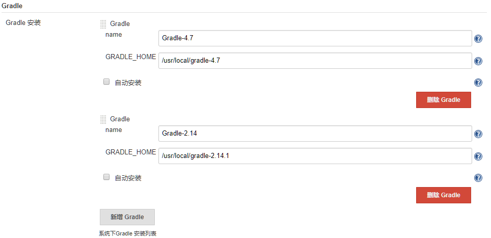
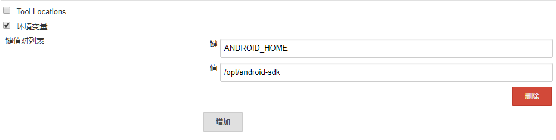

## Jenkins 针对 Android 项目的配置

- Jenkins 自动构建 Android 项目需要提前准备好 Android 相关环境，例如： JDK、 Gradle、 Android-sdk 等，具体安装过程如下：
- JDK 安装配置参见： [ JDK 安装配置 ](../envconfig/env-java-jdk-config.md)，也可以用 rpm 包管理工具安装；
- Gradle 安装配置参见： [ Gradle 安装配置 ](../envconfig/env-gradle-config.md)
- Android-sdk 安装配置参见： [ Android-sdk 安装配置 ](../envconfig/env-android-sdk-config.md)

## 配置 Jenkins 相关工具

- 针对 Android 项目的工具安装完成后，需要在 Jenkins 配置对应的环境路径。

- **配置 Gradle 路径：**
- 打开 Jenkins 主页面，“系统管理” -- “全局工具配置” -- “Gradle 安装” , 具体配置信息如下图所示：
- 

- **配置 Android-SDK 路径：**
- 打开 Jenkins 主页面，“系统管理” -- “系统设置” -- “全局属性” -- “环境变量” ，如下图所示：
- 
