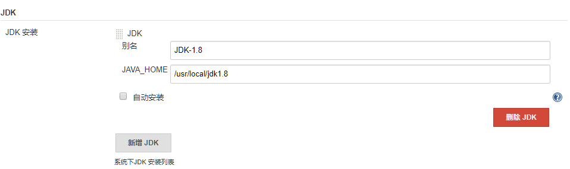
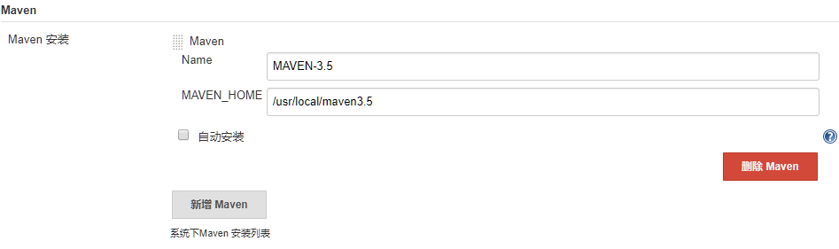
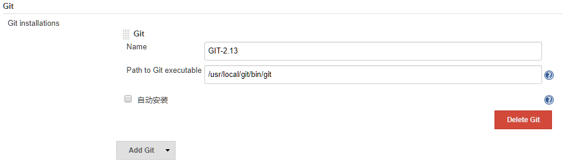
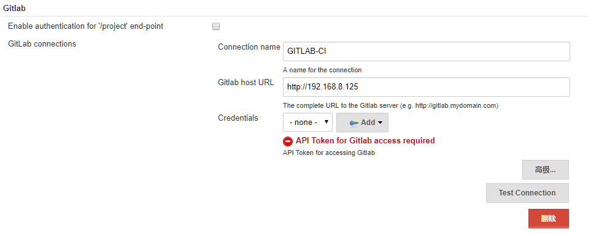

## Jenkins 针对 JAVA 项目的配置

- Jenkins 自动构建 JAVA 项目需要提前准备好 JAVA 相关环境，例如： JDK、 Maven、 Git等，具体安装过程如下：
- JDK 安装配置参见： [ JDK 安装配置 ](../envconfig/env-java-jdk-config.md)，也可以用 rpm 包管理工具安装；
- Maven 安装配置参见： [ Maven 安装配置 ](../envconfig/env-maven-config.md)
- Git 安装配置参见： [ Git 安装配置 ](../envconfig/env-git-installation.md)，也可以用 rpm 包管理工具安装；

  > 上述基本工具建议用二进制的方式安装，这样在 Jenkins 中方便指定相应路径。


### Jenkins 安装相应插件
- Jenkins 构建 JAVA 项目需要安装相关插件，具体插件如下：

  ```bash
  Gitlab Plugin
  #安装之后才可以在系统配置中指定gitlab的IP地址
  
  Git Plugin 
  Git Client Plugin 
  #用于jenkins在gitlab中拉取源码
  
  Publish Over SSH 
  #用于通过ssh部署应用
  
  Maven Integration plugin
  #用于新建maven项目
  ```

- 插件安装流程： "系统管理" -- "管理插件" -- "可用插件"，搜索上述插件即可，选择 "直接安装" 即可。


### Jenkins 指定相关工具路径

- **Jenkins 指定 JDK 路径：**

- 打开并登录 Jenkins 系统管理界面： "系统管理" -- "全局工具配置" -- "JDK 安装"
- 具体信息如下图所示：



- **Jenkins 指定 Maven 路径:**

- 打开并登录 Jenkins 系统管理界面： "系统管理" -- "全局工具配置" -- "Maven 安装"
- 具体信息如下图所示：



- **Jenkins 指定 Git 路径：**
- 打开并登录 Jenkins 系统管理界面： "系统管理" -- "全局工具配置" -- "Git"
- 具体信息如下图所示：


- **Jenkins 配置 Gitlab 地址：**
- 因为我们用 Gitlab 管理项目代码，所以我们需要统一配置 Gitlab 地址： "系统管理" -- "系统设置" -- "Gitlab"
- 具体信息如下图所示：



