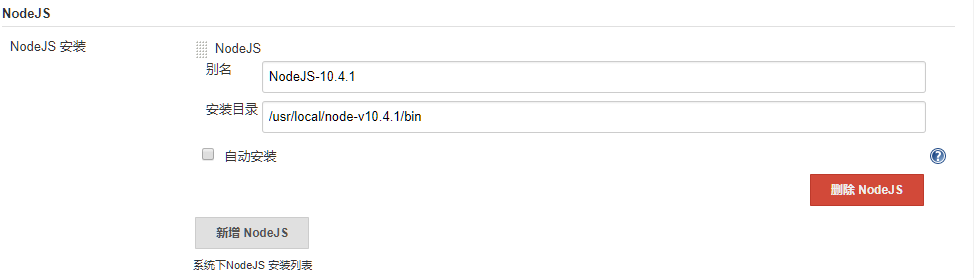

## Jenkins 针对 WEB 前端项目的配置

- Jenkins 持续集成 WEB 前端项目，首先需要准备好 Node.JS 、npm 环境，具体相关环境配置参见：[ Node.JS 环境配置](../envconfig/env-nodejs-config.md)

### Jenkins 配置

- node.js 和 npm 相关环境配置完成后需要在 Jenkins 配置一下路径，具体流程如下：

- **相关插件安装**
- “系统管理” -- “插件管理” -- “可用插件”
- 搜索 “NodeJS Plugin” ，直接安装即可。

- **Jenkins 配置 nodejs 路径**
- “系统管理” -- “全局工具配置” -- “NodeJS” ，具体配置信息如下图所示，路径还需根据实际情况配置:
- 

### NodeJS 镜像配置
- 由于网络的原因，在国内下载 nodejs 相关依赖会很困难，为了加速下载速度，我们可以配置国内的镜像源，具体配置参见: [nodejs 配置国内仓库](../envconfig/env-nodejs-config.md)

- 至此， Jenkins 针对 web 前端的项目基本配置完成。
