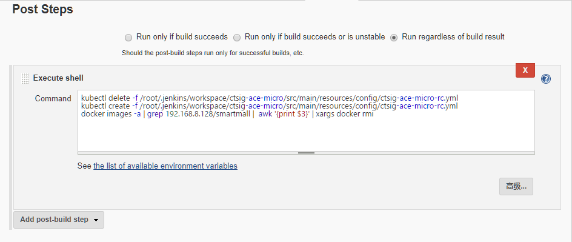

## Jenkins 持续集成 JAVA 项目 - Docker

- 本部分基本流程如下：

  ```bash
  1、 开发人员提交代码到 gitlab 上；
  2、 手动或自动触发 Jenkins 自动构建打 jar 包后并将自动构建的 jar 包打包成 docker 镜像，然后将打包好的 docker 镜像 push 到私有镜像仓库下；
  3、 Jenkins 自动构建完成后，配合 Kubernetes 执行指定命令或脚本，用容器启动对应的镜像来启动对应服务。
  ```

### 配置 Jenkins 相关工具

- 安装完 Jenkins 后，针对 JAVA 项目我们需要配置 Jenkins，具体配置参数参见：[Jenkins-java-config](jenkins-java-config.md)


### Jenkins 新建 JAVA 项目
- 本部分流程和 [ Jenkins 新建 JAVA 项目](ci-java-war-project-config.md) 基本相同,下图所示参数的配置基本类似，按照上述类似配置即可：

- 

- 除上述配置外，还需要配置 “构建后操作”，构建后操作需要结合 `kubectl` 重启对应的微服务。具体命令如下图所示：

- 

- 上述命令实现的功能总结起来就是：

  ```bash
  1、停止先前服务
  2、重启先前服务
  3、删除本地镜像
  ```

### JAVA-Docker 项目需要注意的地方
- Docker 项目和普通的 java 项目不同，相比传统 JAVA 项目配置稍复杂些，首先需要在项目根目录下的 `pom.xml` 配置远程镜像仓库的地址及仓库，示例代码如下：

  ```xml
  <properties>
        <project.build.sourceEncoding>UTF-8</project.build.sourceEncoding>
        <project.reporting.outputEncoding>UTF-8</project.reporting.outputEncoding>
        <!--声明 JDK 版本-->
        <java.version>1.8</java.version>
        <!--声明 docker 私有仓库地址-->
        <docker.repostory>192.168.8.128</docker.repostory>
        <!--声明 docekr 私有仓库中的镜像仓库-->
        <docker.registry.name>citest</docker.registry.name>
  </properties>
  ```

- 还需要声明用于构建 docker 镜像的 dockerfile 文件，示例代码如下：

  ```xml
  <build>
  ...
    <resources>
    	<resource>  
          <directory>src/main/resources</directory>  
          <filtering>false</filtering>  
        </resource>
	    <resource>
	        <directory>src/main/docker</directory>
	        <filtering>true</filtering>
	        <includes>
	           <include>**/Dockerfile</include>
	        </includes>
	        <targetPath>../docker</targetPath>
	    </resource>
    </resources>
  ...
  </build>
  ```

- 我们用的是 `docker-maven-plugin` 构建镜像，所以还需要声明一些关于构建后的 docker 镜像信息，示例代码：

  ```xml
    <configuration>
        <serverId>harbor</serverId>
        <registryUrl>192.168.8.128</registryUrl>
        <pushImage>true</pushImage>
        <dockerDirectory>target/docker</dockerDirectory>
        <imageName>
        ${docker.repostory}/${docker.registry.name}/${project.artifactId}:${project.version}
        </imageName>
        <imageTags>
            <imageTag>${project.version}</imageTag>
        </imageTags>
        <resources>
            <rescource>
            <targetPath>/</targetPath>
            <directory>${project.build.directory}</directory>
            <include>${project.build.finalName}.jar</include>
        </rescource>
        </resources>
    </configuration>

  ```

- 另外为了成功构建，还需要在 maven 配置文件中增加 harbor 私有镜像仓库的验证信息，示例代码如下：

  ```xml
  <servers>
    <server>
      <id>harbor</id>
      <username>xx</username>
      <password>xx</password>
      <configuration>
          <email>xx</email>
      </configuration>
    </server>
  </servers>
  ```

- 配置完成后，“立即构建” 即可，如果遇到问题还需要根据具体报错信息排错即可。

