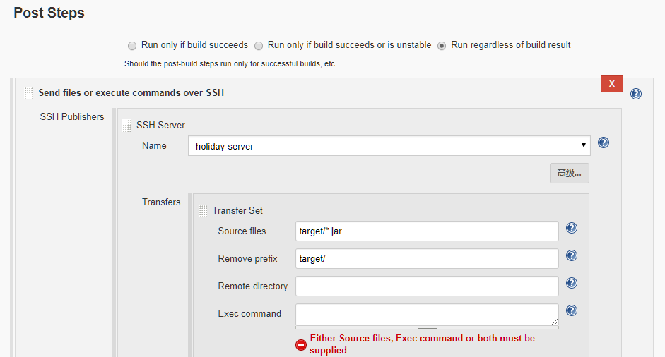

## Jenkins 持续集成 JAVA 项目 - JAR

- 本部分基本流程如下：

  ```bash
  1、 开发人员提交代码到 gitlab 上；
  2、 手动或自动触发 Jenkins 自动构建打 jar 包并将自动构建的 jar 包上传至指定服务器的指定目录下；
  3、 Jenkins 执行远程服务器脚本，kill 掉项目相关进程，将自动构建的 jar 上传至项目指定目录下，然后用新的 jar 启动进程
  ```

### 配置 Jenkins 相关工具

- 安装完 Jenkins 后，针对 JAVA 项目我们需要配置 Jenkins，具体配置参数参见：[Jenkins-java-config](../Jenkins/jenkins-java-config.md)

### Jenkins 新建 JAVA 项目
- 本部分流程和 [ Jenkins 新建 JAVA 项目](ci-java-war-project-config.md) 相同，唯一不同的是 “构建后的操作” 部分, 具体区别如下图所示：


- Source files : target/\*.jar 表示需要传送的文件
- Remove Prefix: 表示只上传 jar 包
- Remote directory: 这里留空，之前配置 `holiday-server` 时已经配置过，所以留空
- Exec Command:  表示构建完成并上传 jar 包到指定服务器指定目录下后需要执行的命令或脚本，一般为 `nohup java -jar $project_name-$project_version.jar &`

  > 大多数情况下我们需要保证服务器环境的整洁，几乎所有项目都是分类保存的，这里我们就需要自己编写脚本对构建完成的 jar 包做处理了。

- 自定义脚本可以参见 [auto-jar.sh](../Shell/auto-jar.sh)
- 配置完成后 “立即构建” 即可。

### 说明
- 与之前 Jenkins 针对 War 包项目的配置 Jenkins 配置 jar 包有几处说明：
- 1、如果需要将项目打成 jar 包需要修改项目根目录下的 `pom.xml` 文件，具体修改位置根据项目实际情况而定，以下是示例代码：

  ```xml
  <modelVersion>4.0.0</modelVersion>
  <groupId>com.ctsig.microservice.springcloud</groupId>
  <artifactId>zipkinserver</artifactId>
  <version>0.0.1-SNAPSHOT</version>
  <!--需要修改的地方-->
  <packaging>jar</packaging>        
  ```

- “构建设置” 选项和邮件发送有关，这里也不再配置。
- 配置完成后点击 “立即构建” 开始构建项目，可以从控制台看到构建日志。
