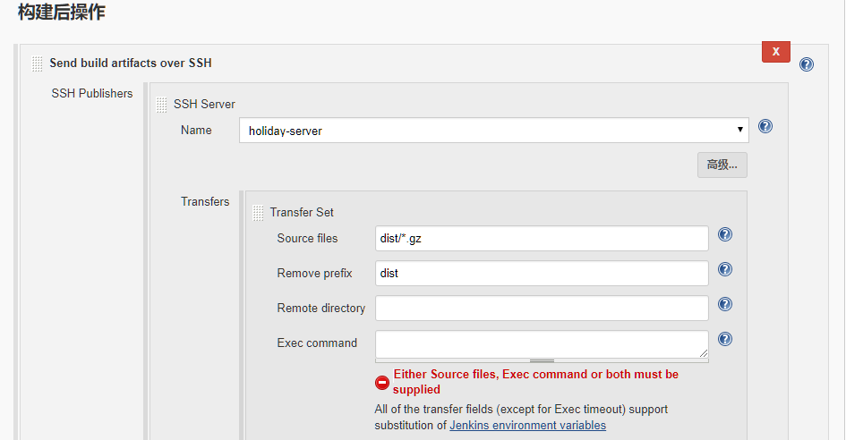

## Jenkins 持续集成前端(WEB)项目

- 本部分基本流程如下：

  ```bash
  1、 开发人员提交代码到 gitlab 上；
  2、 手动或自动触发 Jenkins 编译构建并将构建完成的产出文件打包并上传至指定服务器的指定目录下；
  3、 Jenkins 执行远程服务器脚本，将先前的前端文件删除并将新生成的文件解压的 web 服务器指定目录下，因为前端项目不需要重启，所以不需要重启 web 服务器。
  ```

### 配置 Jenkins 相关工具

- 安装完 Jenkins 后，针对 WEB 前端项目我们需要配置 Jenkins，具体配置参数参见：[Jenkins-web-config](../Jenkins/jenkins-web-config.md)


### Jenkins 新建 WEB 前端项目
- 打开 Jenkins 控制面板按如下步骤操作即可：
- "**新建任务**"--"**输入任务名称**"--"**构建一个自由风格的项目**"--"**确定**"
- 点击确定后会弹出项目相关配置界面，我们需要配置相关信息，具体包括： General-源码管理-构建触发器-构建环境-构建-构建后操作，其中 “General-源码管理-构建触发器-构建环境” 配置和配置 java 项目的配置类似，具体参见 [ jenkins 持续集成 java 项目](../CI/ci-java-war-project-config.md),这里只是说明一下不同的地方的配置，具体如下：

- **构建** 操作具体配置信息如下图所示：
- 

- 大多数情况下我们不只是构建前端项目那么简单，我们需要的是构建成功后自动部署到指定 web 服务器。
- 前端项目编译构建后一般编译产出文件存放在 `dist` 目录下，我们需要将此目录下的文件打包成压缩包，然后上传至指定服务器目录下。

- **构建** 操作新增加打包内容，如下图所示：
- 

- 构建打包成功后，`dist` 目录下的文件如下图所示：
- 

- **构建后操作** ，构建成功后需要将打包文件上传至服务器指定目录下，如下图所示：
- 

- 一般上传完成后，我们需要自定义脚本，脚本主要工作就是备份以前的文件然后用新文件替换掉以前的文件，脚本挺简单的，这里不再赘述，

- 配置完成后，试着 “立即构建” ，如果报错，可以根据具体报错信息排错。

